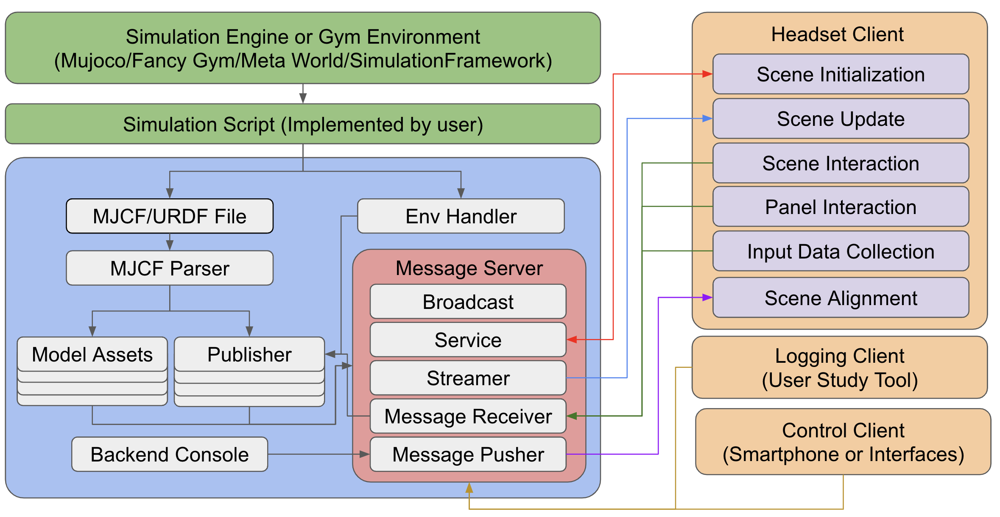

# Intuitive Robot & Mixed Reality (IRXR-Unity)

This repository aims to enhance robot simulation by making it more intuitive and interactive through Mixed Reality (MR). 
Current visualization devices, such as XR/AR/VR glasses, support only basic physics simulations and are not tailored for research-driven simulation due to their limited computational resources.



To ensure the reproducibility of simulation results, we have decoupled the simulation and rendering processes onto two separate machines. 
This framework allows for more efficient and accurate simulations. 
The Unity and simulation are interconnected via [SimPublisher](https://github.com/intuitive-robots/SimPublisher.git), which simplifies the process of remotely rendering simulated objects from the simulation.
This repo is the implementation of rendering.

### Deploy Unity Project

Clone this repo:

```bash
git clone https://github.com/intuitive-robots/IRXR-Unity.git
git fetch
```

If you are using Meta Quest 3, run
```bash
git checkout meta-quest3-dev
```
and the follow the [Meta Quest 3 deploy instruction](./Docs/MetaQuest3Deploy.md). 

If you are using Meta Quest 3, run
```bash
git checkout hololens2-dev
```
and the follow the [HoloLens2 instruction](./Docs/HoloLens2Deploy.md). 


### Run your application

We use [SimPublisher](https://github.com/intuitive-robots/SimPublisher.git) to make the communication eaiser. 
It is also highly recommanded to create your own application by using this repo.

Keep your XR/AR/VR device and your simulation PC in a subnet.
Run the server and this Unity application from the XR/AR/VR device,
and this Unity project will automatically search available PC in the subnet and connect.

## Application

### HDAR: Create human demonstration by Augmented Reality


Please contact me (xinkai.jiang@kit.edu) if you have question.

[Submodule Code](https://github.com/intuitive-robots/HDAR) | [Paper Website](https://intuitive-robots.github.io/HDAR-Simulator/)

The [HDAR](https://github.com/intuitive-robots/HDAR) applicatin is used to create human demonstration by Augmented Reality.

This application supports our paper ["A Comprehensive User Study on Augmented Reality-Based data Collection Interfaces for Robot Learning"](https://intuitive-robots.github.io/HDAR-Simulator/), which was published on HRI2024. If you find our work useful, please consider citing.

```latex
@inproceedings{jiang2024comprehensive,
title={A Comprehensive User Study on Augmented Reality-Based data Collection Interfaces for Robot Learning},
author={Jiang, Xinkai and Mattes, Paul and Jia, Xiaogang and Schreiber, Nicolas and Neumann, Gerhard and Lioutikov, Rudolf},
booktitle={Proceedings of the 2024 ACM/IEEE International Conference on Human-Robot Interaction},
pages={333--342},
year={2024}
}
```